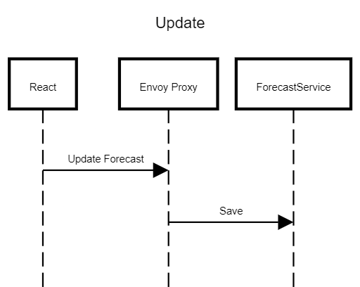
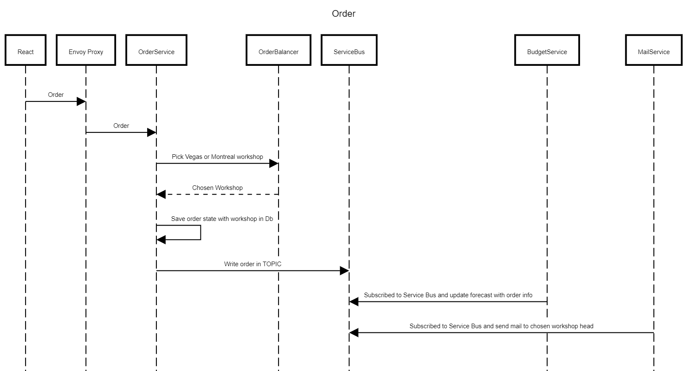

# learn-dapr-with-ebook
Learn dapr with ebook

https://github.com/dotnet-architecture/eBooks/blob/1ed30275281b9060964fcb2a4c363fe7797fe3f3/current/dapr-for-net-developers/Dapr-for-NET-Developers.pdf

## DaprCdsOrder

Inspired by the forecast screen i worked on while building KIM this is a project to learn and practices microservices with dapper

There are two scenarios : 

### Update Flow

### Order Flow
